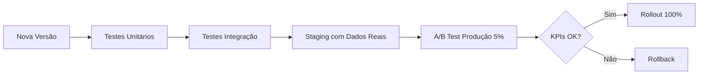

# **Master Engineering Framework (MEF) v1.0**
## *Protocolo Unificado para Desenvolvimento, Operação e Evolução de Software*

---

## **PARTE I: DESENVOLVIMENTO (Build Phase)**
### Baseado no Protocolo SDD v2.0

### 1. Avaliação Inicial da Tarefa (Matriz de Decisão)

**Vetores de Avaliação:**

| Vetor | Peso | Classificação |
|-------|------|---------------|
| **Complexidade Técnica** | 40% | Baixa (1pt) / Média (2pts) / Alta (3pts) |
| **Familiaridade do Domínio** | 30% | Alta (1pt) / Média (2pts) / Baixa (3pts) |
| **Risco e Impacto** | 20% | Baixo (1pt) / Médio (2pts) / Alto (3pts) |
| **Contexto Disponível** | 10% | Completo (1pt) / Vago (3pts) |

**Score Final:** `(Complexidade × 0.4) + (Familiaridade × 0.3) + (Risco × 0.2) + (Contexto × 0.1)`

### 2. Protocolos de Execução por Complexidade

| Score | Categoria | Protocolo | Deliverables |
|-------|-----------|-----------|--------------|
| 1.0 - 1.4 | 🟢 TRIVIAL | Zero-Shot | Código direto |
| 1.5 - 1.9 | 🟡 SIMPLES | SDD Lite | Mockup → Código |
| 2.0 - 2.4 | 🟠 MÉDIA | SDD Moderado | PRD-Lite → SPEC → Código |
| 2.5 - 3.0 | 🔴 COMPLEXA | SDD Full | Research → Blueprint → Código Faseado |

### 3. Regras de Ouro do Desenvolvimento

```
✓ Search First, Code Later
✓ Especificação é Lei
✓ Zero Alucinação de Import
✓ Anotação de Código Proporcional à Complexidade
✓ Auto-Correção Proativa
```

---

## **PARTE II: OPERAÇÃO & EVOLUÇÃO (Run & Improve Phase)**
### Baseado em LLMOps/DevOps Moderno

### 4. Gerenciamento de Configuração e Versionamento

**Requisitos Obrigatórios:**

```yaml
VERSION_CONTROL:
  - Todo componente (código, config, prompts, API calls) DEVE ser versionado
  - Alterações geram versão imutável (V1 → V2 → V3)
  - Rollback deve ser instantâneo
  - Rastreabilidade: "Qual versão o usuário X usou na interação Y?"

STRUCTURE:
  /versions
    /v1.0.0
      - source_code/
      - configs/
      - prompts/
      - CHANGELOG.md
    /v1.1.0
      - source_code/
      - configs/
      - prompts/
      - CHANGELOG.md
```

**Implementação:**
- Git Tags/Branches para código
- Feature Flags para configs
- Prompt Registry para LLM calls

---

### 5. Observabilidade e Rastreabilidade (Tracing)

**Stack Mínimo:**

```python
# Estrutura de Log Obrigatória
LOG_SCHEMA = {
    "timestamp": "ISO8601",
    "version": "software_version",
    "user_id": "identifier",
    "input": {
        "request": "...",
        "context": "...",
    },
    "execution": {
        "steps": [
            {"step_name": "db_query", "duration_ms": 45, "status": "success"},
            {"step_name": "api_call", "duration_ms": 230, "status": "success"},
            {"step_name": "llm_inference", "duration_ms": 1200, "status": "success"}
        ],
        "total_duration_ms": 1475
    },
    "output": {
        "response": "...",
        "status_code": 200
    },
    "errors": []
}
```

**Ferramentas Sugeridas:**
- **APM:** DataDog / New Relic / Grafana
- **Logging:** ELK Stack / CloudWatch
- **Tracing:** OpenTelemetry / Jaeger

**Requisitos:**
- ✅ Capturar Input/Output completo
- ✅ Rastrear etapas intermediárias (spans)
- ✅ Medir latência por componente
- ✅ Armazenar em Data Warehouse para análise

---

### 6. Avaliação Sistemática de Desempenho (QA & Testing)

**Framework de Métricas:**

```yaml
KPIS_OBRIGATORIOS:
  Funcionais:
    - Taxa de Sucesso (%)
    - Taxa de Erro por Categoria (%)
    - Assertividade (Precisão/Recall)
  
  Performance:
    - Latência P50/P95/P99 (ms)
    - Throughput (req/s)
    - Taxa de Timeout (%)
  
  Negócio:
    - Taxa de Conversão (%)
    - NPS/CSAT
    - Churn (%)
```

**Protocolo de Teste:**



**Implementação:**
- Definir thresholds de qualidade (ex: "Latência P95 < 2s")
- Automatizar testes de regressão
- A/B Testing com significância estatística

---

### 7. Melhoria Contínua Baseada em Dados (Feedback Loop)

**Ciclo OODA Aplicado:**

```
┌─────────────────────────────────────────┐
│  1. OBSERVE (Observabilidade)           │
│     - Coletar logs, traces, métricas    │
│     - Identificar anomalias             │
└────────────┬────────────────────────────┘
             │
             ▼
┌─────────────────────────────────────────┐
│  2. ORIENT (Avaliação)                  │
│     - Analisar KPIs vs. Thresholds      │
│     - Correlacionar eventos             │
│     - Priorizar problemas               │
└────────────┬────────────────────────────┘
             │
             ▼
┌─────────────────────────────────────────┐
│  3. DECIDE (Planejamento)               │
│     - Definir sprint baseado em dados   │
│     - Escolher protocolo SDD adequado   │
└────────────┬────────────────────────────┘
             │
             ▼
┌─────────────────────────────────────────┐
│  4. ACT (Desenvolvimento)               │
│     - Executar SDD (Build Phase)        │
│     - Gerar nova versão                 │
└────────────┬────────────────────────────┘
             │
             └──► VOLTA PARA OBSERVE
```

**Reunião de Retrospectiva Obrigatória:**

```markdown
# Sprint Retrospective Template

## Dados da Sprint Anterior
- **Versão:** v1.2.0
- **Período:** 01/Jan - 07/Jan
- **Deploy:** 100% em 05/Jan

## Métricas Observadas
| Métrica | Atual | Anterior | Delta |
|---------|-------|----------|-------|
| Latência P95 | 1.8s | 2.1s | -14% ✅ |
| Taxa de Erro | 2.3% | 1.8% | +27% ⚠️ |
| Conversão | 12% | 11% | +9% ✅ |

## Root Cause Analysis
**Problema:** Taxa de erro aumentou 27%
**Causa Raiz:** Timeout na API externa (step: `external_api_call`)
**Evidência:** Logs mostram 230ms → 3.2s em 18% das chamadas

## Ações para Próxima Sprint
1. Implementar circuit breaker (Score: 2.2 → SDD Moderado)
2. Aumentar timeout de 2s para 5s (Score: 1.2 → Zero-Shot)
3. Adicionar fallback com cache (Score: 2.4 → SDD Moderado)
```

---

## **PARTE III: GOVERNANÇA & COMPLIANCE**

### 8. Checklist de Qualidade por Fase

**Pre-Development (Antes de Codar):**
- [ ] Score SDD calculado e protocolo selecionado
- [ ] Web Search executado (se Score > 1.4)
- [ ] PRD/SPEC aprovado (se Score ≥ 2.0)

**Development (Durante):**
- [ ] Código segue SPEC.md (sem improvisações)
- [ ] Comentários/Docstrings adequados ao Score
- [ ] Testes unitários escritos (Score ≥ 1.5)

**Pre-Deployment (Antes de Prod):**
- [ ] Versionamento aplicado (tag Git + CHANGELOG)
- [ ] Observabilidade instrumentada (logs + traces)
- [ ] KPIs baseline definidos
- [ ] Estratégia de rollback testada

**Post-Deployment (Após Prod):**
- [ ] Monitoramento ativo (alertas configurados)
- [ ] A/B Test em execução (se aplicável)
- [ ] Retrospectiva agendada

---

### 9. Matriz de Decisão Rápida

```
┌─────────────────────────────────────────────────────┐
│  SEMPRE SE PERGUNTE:                                │
│                                                      │
│  1. Qual o Score SDD desta tarefa?                  │
│  2. Já tenho observabilidade suficiente?            │
│  3. Esta mudança é rastreável e reversível?         │
│  4. Tenho métricas para validar o sucesso?          │
│  5. O feedback loop está fechado?                   │
└─────────────────────────────────────────────────────┘
```

---

## **GLOSSÁRIO**

- **SDD:** Specification-Driven Development
- **LLMOps:** MLOps aplicado a Large Language Models
- **APM:** Application Performance Monitoring
- **P95:** Percentil 95 (95% das requisições são mais rápidas que este valor)
- **Tracing:** Rastreamento de execução distribuída
- **Rollback:** Reverter para versão anterior

---

## **COMO USAR ESTE FRAMEWORK**

### Para Nova Feature:
1. Calcule Score SDD → Selecione protocolo
2. Desenvolva seguindo SDD
3. Implemente observabilidade desde o início
4. Defina KPIs de sucesso
5. Deploy com feature flag (0% → 5% → 100%)
6. Monitore e itere

### Para Sistema Legado:
1. **Fase 1:** Adicione observabilidade (instrumentação)
2. **Fase 2:** Colete dados por 1-2 semanas
3. **Fase 3:** Analise gargalos e defina KPIs
4. **Fase 4:** Aplique SDD para refatorações priorizadas
5. **Fase 5:** Entre no ciclo OODA
